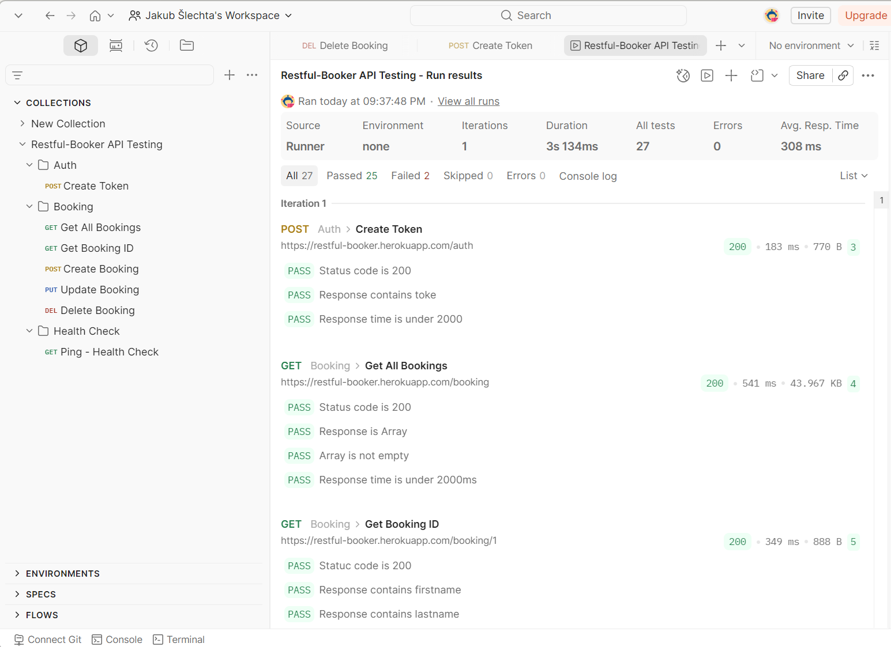
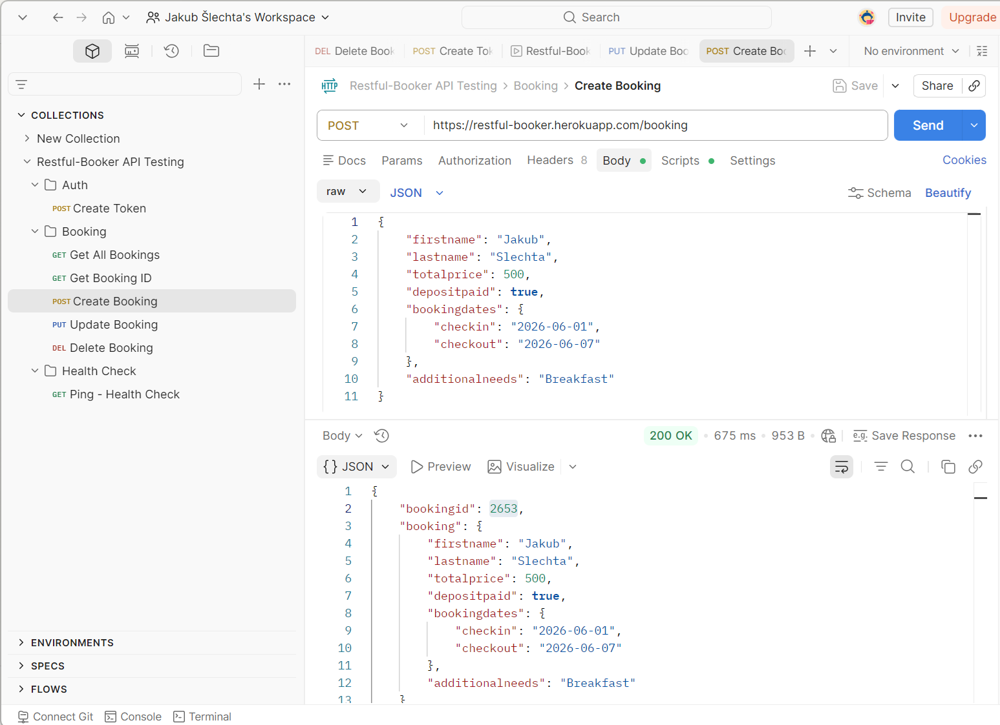
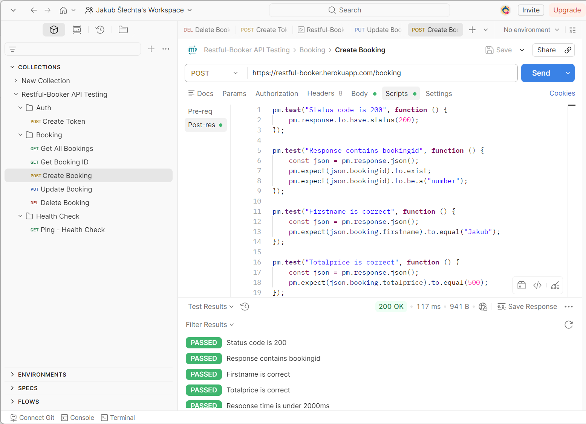

# API Testing — Restful-Booker

Portfolio projekt API testování reálného REST API pomocí Postmanu.

**Testované API:** [Restful-Booker](https://restful-booker.herokuapp.com/apidoc)  
**Typ testování:** REST API testování s automatickými asserty  
**Nástroje:** Postman, JavaScript (Chai assertions)  
**Datum:** Duben 2026

---

## Výsledky

| Metrika | Hodnota |
|---|---|
| Requestů celkem | 7 |
| Testů celkem | 27 |
| PASSED | 25 |
| FAILED | 2 |
| Průměrná response time | 308 ms |
| Celková doba běhu | 3,1 s |

> 2 FAILED testy jsou způsobeny hardcoded ID v Delete Booking — rezervace byla smazána v předchozím běhu. Logika testů je správná.

---

## Pokryté endpointy

| Metoda | Endpoint | Popis | Testy |
|---|---|---|---|
| GET | `/ping` | Health check — ověření dostupnosti API | 3 |
| POST | `/auth` | Vytvoření autentizačního tokenu | 3 |
| GET | `/booking` | Získání seznamu všech rezervací | 4 |
| GET | `/booking/{id}` | Získání detailu konkrétní rezervace | 5 |
| POST | `/booking` | Vytvoření nové rezervace | 5 |
| PUT | `/booking/{id}` | Aktualizace existující rezervace | 4 |
| DELETE | `/booking/{id}` | Smazání rezervace | 3 |

---

## Co bylo testováno

- Status codes (200, 201, 403, 405)
- Response body — existence a správnost dat
- Datové typy (string, number)
- Response time (pod 2000ms)
- Autentizace pomocí tokenu (Cookie header)
- CRUD operace — Create, Read, Update, Delete

---

## Ukázka testu

```javascript
pm.test("Response contains bookingid", function () {
    const json = pm.response.json();
    pm.expect(json.bookingid).to.exist;
    pm.expect(json.bookingid).to.be.a("number");
});

pm.test("Firstname is correct", function () {
    const json = pm.response.json();
    pm.expect(json.booking.firstname).to.equal("Jakub");
});
```

---

## Screenshoty

### Collection Runner — výsledky


### Ukázka requestu — Create Booking


### Ukázka testů — Get Booking by ID


---

## Struktura projektu

```
api-testing-restful-booker/
├── README.md
├── restful-booker.postman_collection.json
└── screenshots/
    ├── collection_runner.png
    ├── create_booking.png
    └── test_results.png
```

---

## Spuštění kolekce

1. Nainstaluj [Postman](https://www.postman.com/downloads/)
2. Importuj `restful-booker.postman_collection.json`
3. Klikni pravým na kolekci → **Run collection**
4. Klikni **Start run**

---

